# HyperSDR: Autonomous Voice Sales Development Representative (SDR)
### Built for the AssemblyAI Voice Agent Hackathon (September 2026 • Lablab.ai)

> **Live Production Web Dialer:** [https://hypersdr-assemblyai.onrender.com](https://hypersdr-assemblyai.onrender.com)  
> **Source Code:** [https://github.com/AbrarMuhtasim14/assemblyai-hypersdr](https://github.com/AbrarMuhtasim14/assemblyai-hypersdr)  
> **Author:** Syed Mohammed Abrar Mohtasim ([abrarmuhtasim400@gmail.com](mailto:abrarmuhtasim400@gmail.com))

---

## 🎯 Executive Summary & Value Proposition

**HyperSDR** is a production-grade, low-latency autonomous Voice SDR engineered on top of the **AssemblyAI Voice Agent API** (`wss://agents.assemblyai.com/v1/ws`). 

Targeting an enriched directory of **212 luxury US boutique hotels and historic inns**, HyperSDR solves the two most urgent financial threats facing independent hospitality proprietors:
1. **$150,000–$350,000+ Annual OTA Commission Leakage:** Shifting repeat guests off high-fee online travel agencies (Expedia & Booking.com charging 18%–22%) and routing them into direct website booking engines.
2. **Google Maps 3-Pack Reputation Fragility:** Deploying private 48-hour post-stay review routing that resolves guest friction before complaints reach Google Reviews.

---

## 📽️ Slide Deck Overview (10 Slides)

```mermaid
flowchart LR
    S1[1. Title & Value Prop] --> S2[2. The $338k OTA Problem]
    S2 --> S3[3. HyperSDR Solution]
    S3 --> S4[4. AssemblyAI Voice Stack]
    S4 --> S5[5. 212 Enriched Leads Engine]
    S5 --> S6[6. Google Calendar & Meet Tool]
    S6 --> S7[7. Comfort Noise Layer]
    S7 --> S8[8. 2-Way Sheet & Speech Intel]
    S8 --> S9[9. Market ROI & Business Model]
    S9 --> S10[10. Live Demo & Submission]
```

---

### Slide 1: Title & Hero
* **Project Name:** HyperSDR (Autonomous Voice SDR)
* **Core Technology:** AssemblyAI Voice Agent API (`Universal-3.5 Pro` STT + `George` Voice)
* **Target Audience:** 212 US Luxury Boutique Hotels & Historic Inns
* **Key Differentiator:** Real-time tool calling with instant Google Calendar API event creation, genuine Google Meet generation, and live two-way Google Sheet CRM database sync.

---

### Slide 2: Market Breakdown & Pain Points
* **The OTA Commission Trap:** Independent boutique properties pay 18%–22% commissions on repeat guests who already love their brand.
* **Reputation Vulnerability:** A single unaddressed 1-star review on Google Maps drops properties out of the local 3-Pack, causing drastic reductions in organic weekend revenue.
* **Front-Desk Burden:** Innkeepers and general managers lack the technical bandwidth or budget to operate complicated new software.

---

### Slide 3: The HyperSDR Solution
* **Hyper-Personalized Review Hooks:** Alex (SDR) opens calls referencing specific verified details (e.g. *Chef Jim Gunther's scratch-made breakfasts*, *panoramic red rock labyrinths*, *afternoon Victorian pies*).
* **Consultative SPIN Cold Calling:** Seamlessly verifies bottlenecks, calculates exact commission savings, and handles objections gracefully.
* **Frictionless Handoff:** Books 15-minute strategy syncs directly onto Google Calendar with zero human intervention.

---

### Slide 4: Real-Time Architecture & AssemblyAI Stack
* **WebSocket Edge Streaming:** Full-duplex PCM16 audio streamed directly between client browser, Node.js backend, and `wss://agents.assemblyai.com/v1/ws`.
* **Universal-3.5 Pro STT:** Sub-second speech recognition with voice activity detection (VAD).
* **George Ultra-Low Latency Voice:** Crisp, human-like voice synthesis with barge-in interruption capability.
* **Client-Side Token Minting:** Ephemeral token generation via `/api/token` for authenticated sessions.

---

### Slide 5: The 212 Pre-Qualified Luxury Inns Dataset
* **Enriched Attributes:**
  * Property Name & Location (Napa Valley, Sedona, Lake Worth Beach, Shenandoah, Maine, Vermont)
  * Named Proprietor & Executive Title (Jim Gunther, Cheryl Michaelsen, Brian Mulcahy)
  * Google Review Score & Count (3-Pack placement verified)
  * Verbatim Guest Review Snippet & Signature Amenity
  * Calculated Annual OTA Commission Savings ($135,415 – $338,538/year)
* **Timing Intelligence:** Real-time multi-timezone clocks across Eastern, Central, Mountain, and Pacific time zones.

---

### Slide 6: Real-Time Tool Calling & Dynamic Google Calendar
* **`book_calendar_slot`**:
  * Interprets colloquial dates ("Monday, Oct 5 at 5 PM", "tomorrow after 5 PM") with timezone-accurate offsets (`America/Los_Angeles`, `America/New_York`).
  * Generates real Google Meet video conference links (`https://meet.google.com/nqs-udup-yss`).
  * Inserts events via Google Calendar API v3 without spamming test leads.
* **`calculate_ota_commission_savings`**:
  * Real-time calculation based on room count, ADR ($265), and OTA distribution (50%).
* **`mark_call_disposition`**:
  * Dispatches final BANT qualification score and key takeaways to CRM.

---

### Slide 7: LiveKit-Style Comfort Noise & Audio Layer
* **Eliminating "Dead Air":** Synthesizes subtle background room tone using a WebAudio pink/brown noise generator during listening and tool execution.
* **Selectable Presets:**
  * `🏢 Subtle Sales Office`
  * `📞 Vintage Telephone Line Warmth`
  * `☕ Quiet Room Acoustics`
  * `🔇 Off`
* **Visual Telemetry:** Real-time dual canvas waveform visualizer and live audio volume control.

---

### Slide 8: Two-Way Google Sheet Sync & Speech Intelligence
* **Post-Call Speech Intelligence:** Synthesizes complete call transcripts into structured CRM fields:
  * **BANT Score:** Budget (25), Authority (25), Need (25), Timeline (25) $\rightarrow$ **100/100**.
  * **Objections Audited:** Logged and classified (e.g. *OTA commission leakage*, *software overhead concern*).
  * **Follow-up Email Generation:** Auto-drafted email summary tailored to the property.
* **Google Sheets API v4 Integration:** Direct row update into Google Sheet with zero edge caching.

---

### Slide 9: Quantifiable ROI & Business Model
* **$338,538/year:** Average annual revenue recovered per 20-room luxury inn.
* **Zero Software Overhead:** Concierge operates entirely in the background via automated webhooks.
* **Turnkey Partner Model:** White-label technical execution model for boutique agency partners and hospitality operators.

---

### Slide 10: Live Production Links & Submission Hub
* **Live Web App:** [https://hypersdr-assemblyai.onrender.com](https://hypersdr-assemblyai.onrender.com)
* **GitHub Repository:** [https://github.com/AbrarMuhtasim14/assemblyai-hypersdr](https://github.com/AbrarMuhtasim14/assemblyai-hypersdr)
* **Platform:** Hosted 24/7 on Render Cloud with native WebSockets.
* **Built By:** Syed Mohammed Abrar Mohtasim for the AssemblyAI Voice Agent Hackathon on Lablab.ai.
