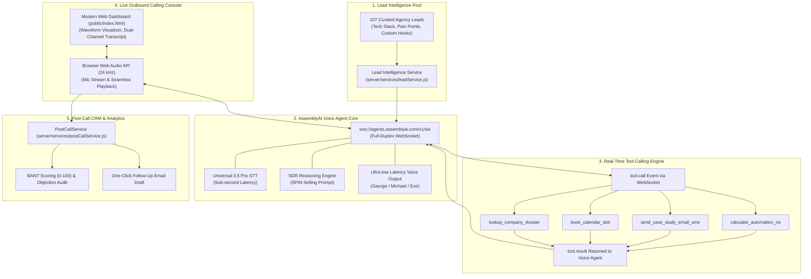

# ⚡ HyperSDR: Autonomous Outbound Sales Voice Agent
> **Built for the AssemblyAI Voice Agent Hackathon on [Lablab.ai](https://lablab.ai/ai-hackathons/assemblyai-voice-agent-hackathon)**  
> **Author:** Syed Mohammed Abrar Mohtasim ([@AbrarMuhtasim14](https://github.com/AbrarMuhtasim14))  
> **Stack:** AssemblyAI Voice Agent API • Universal-3.5 Pro • Node.js • Web Audio API • Twilio SIP  

[](https://www.assemblyai.com/products/voice-agent-api)
[](https://lablab.ai/ai-hackathons/assemblyai-voice-agent-hackathon)
[](https://opensource.org/licenses/MIT)

---

## 🎯 The Problem & Vision

Traditional B2B outbound cold calling is expensive, slow, and unscalable:
- Hiring human SDRs costs **$60,000–$85,000/year** per rep, with high turnover and inconsistent pitch delivery.
- Generic AI chatbots are purely reactive—they wait for visitors to ask questions and lack deep company research.
- Most cold calls fail within 10 seconds because reps use generic scripts rather than referencing the prospect's actual tech stack and operational bottlenecks.

**HyperSDR solves this.** It is an autonomous, hyper-personalized Outbound Sales Development Representative (SDR) Voice Agent built directly on the **AssemblyAI Voice Agent API**. HyperSDR proactively places calls to qualified B2B agency founders and decision-makers, opening with tailored icebreakers, handling technical objections using SPIN-selling methodology, triggering real-time actions during the call (calculating ROI, sending case studies, booking calendar slots), and compiling post-call BANT qualification audits into the CRM.

---

## 🚀 Key Architectural Innovations

### 1. Dynamic Lead Intelligence Dossier Injection
Before the call connects, HyperSDR ingests a rich intelligence dossier for the target prospect:
- **Decision Maker Details**: Name, Title, Agency Name, Location, Team Size.
- **Inferred Tech Stack**: E.g., GoHighLevel, Twilio 10DLC, HubSpot, Zapier, WordPress.
- **Identified Operational Bottleneck**: E.g., *"Native GHL automations break when scaling; onboarding takes hours of manual custom value setup."*
- **Tailored Solution**: E.g., *"Turnkey n8n Snapshot Deployment Pipeline provisioning sub-accounts via API in 3 mins."*
- **Dynamic Icebreaker Hook**: Custom opening line spoken naturally by the agent.
- **Objection Playbooks**: Tailored answers for "We use Zapier", "We have no budget", "Send me an email", "Are you an AI?".

### 2. End-to-End Voice AI on AssemblyAI Voice Agent API
- **Single WebSocket Connection**: Direct bi-directional full-duplex streaming at `wss://agents.assemblyai.com/v1/ws`.
- **Sub-Second Latency**: Real-time STT powered by AssemblyAI's Universal-3.5 Pro engine.
- **Natural Voice Synthesis**: Native low-latency conversational voices (`george`, `michael`, `eve`, `alba`, `charles`, `anna`).
- **Turn Detection & Interruptible Barge-In**: Employs speech-aware VAD; when a prospect interrupts or raises an objection, HyperSDR immediately halts speech playback and listens.

### 3. Real-Time Tool Calling Engine
Compliant with AssemblyAI's flat JSON-Schema specification, HyperSDR can invoke real-time tools mid-call:
| Tool Name | Trigger Condition | Execution Outcome |
|---|---|---|
| `lookup_company_dossier` | Prospect asks: *"How do you know what we do?"* | Fetches verified agency focus, team size, and tech stack details. |
| `calculate_automation_roi` | Prospect asks: *"What kind of savings or ROI are we looking at?"* | Calculates exact weekly hours saved and projected annual financial ROI. |
| `send_case_study_email_sms` | Prospect says: *"Can you send me an email or case study first?"* | Dispatches relevant PDF case study & Loom walkthrough to prospect's email live during the call. |
| `book_calendar_slot` | Prospect agrees: *"Sure, let's chat Thursday at 2 PM."* | Confirms availability, reserves slot, and sends Google Meet invite. |
| `mark_call_disposition` | Call concludes | Updates CRM with lead status, qualification score, and next steps. |

### 4. Post-Call Speech Intelligence & BANT Audit
When the call ends, HyperSDR analyzes the full conversation transcript:
- **BANT Qualification Gauge**: Scores Budget (25), Authority (25), Need (25), Timeline (25) out of 100.
- **Objection Audit**: Logs all prospect hesitations and how the SDR handled them.
- **Executive Summary**: 2-3 sentence overview of the conversation.
- **Automated Follow-Up Email**: Drafts a personalized recap email ready for one-click copy or automated delivery.

---

## 🏛️ System Architecture



---

## 🛠️ Project Structure

```
assemblyai-outbound-sdr/
├── .env.example                       # Environment configuration template
├── package.json                       # Fast Node.js dependencies
├── README.md                          # Comprehensive project documentation
├── server/
│   ├── server.js                      # Express HTTP + WebSocket relay server
│   ├── assemblyai/
│   │   ├── client.js                  # AssemblyAI Voice Agent API WebSocket client
│   │   ├── promptBuilder.js           # Dynamic SDR Prompt & Lead Dossier injector
│   │   └── tools.js                   # JSON-Schema tool definitions & execution engine
│   ├── services/
│   │   ├── leadService.js             # Ingests and enriches 107 agency leads
│   │   ├── crmService.js              # Manages persistent call logs and BANT history
│   │   └── postCallService.js         # Speech intelligence, BANT audit, email generator
│   └── telephony/
│       └── twilioAdapter.js           # Twilio SIP trunking & outbound phone dialer
├── public/
│   ├── index.html                     # Sleek dark-mode Sales Console UI
│   ├── app.js                         # Web Audio 24kHz streaming, visualizers, state
│   └── style.css                      # Modern dark theme styles
├── data/
│   └── call_logs.json                 # Persisted CRM call history
└── test/
    └── verify_pipeline.js             # Automated end-to-end pipeline test
```

---

## ⚡ Quick Start Guide

### Prerequisites
- **Node.js**: v18+ (tested on Node v24)
- **AssemblyAI API Key**: Obtain from [assemblyai.com](https://www.assemblyai.com/dashboard/signup?utm_source=event&utm_medium=credit-grant&utm_campaign=lablab_virtual_hackathon)

### 1. Installation
```bash
cd f:/Automation/assemblyai-outbound-sdr
npm install
```

### 2. Configure Environment
Create `.env` based on `.env.example`:
```ini
ASSEMBLYAI_API_KEY=your_assemblyai_api_key_here
ASSEMBLYAI_AGENT_ENDPOINT=wss://agents.assemblyai.com/v1/ws
PORT=3000
HOST=0.0.0.0

# Optional Twilio Config for PSTN Calls
TWILIO_ACCOUNT_SID=
TWILIO_AUTH_TOKEN=
TWILIO_PHONE_NUMBER=
```

### 3. Run Automated Verification Test
Run the end-to-end pipeline test to verify WebSocket connection, agent provisioning, live speech streaming, and post-call auditing:
```bash
npm test
```

### 4. Start the Application
```bash
npm start
```
Open **`http://localhost:3000`** in your browser.

---

## 🎬 Live Demonstration Walkthrough

1. **Select a Target Lead**:
   - Choose a curated agency from the dropdown (e.g. *Just Digital Inc. — Hugo Fernandez* or *GoLevely — Abby McClain*).
   - Review their live dossier: operational bottleneck, tech stack, and tailored value proposition.
2. **Initiate Outbound Call**:
   - Click **"📞 Initiate Outbound Call"**.
   - Alex (the SDR) connects via AssemblyAI Voice Agent API and opens with a tailored hook referencing the agency's niche.
3. **Interactive Spoken Conversation & Barge-In**:
   - Speak naturally through your microphone.
   - Say: *"Who is this?"* -> Alex explains who he is and why he's reaching out.
   - Say: *"Can you send me a case study or email first?"* -> Watch the **`send_case_study_email_sms`** tool trigger live on screen!
   - Say: *"What kind of ROI or savings can we expect?"* -> Watch **`calculate_automation_roi`** calculate exact dollar savings.
   - Say: *"Sure, let's chat Thursday at 2 PM."* -> Watch **`book_calendar_slot`** reserve the meeting and dispatch the calendar invite!
   - Test interrupting the agent mid-sentence -> HyperSDR immediately ceases playback and listens to you.
4. **Post-Call CRM Audit**:
   - Click **"End Call & Audit"**.
   - The Post-Call modal pops up showing:
     - BANT Qualification Score (e.g., `85/100`)
     - Categorized Objections Audited
     - Executive Call Summary
     - One-Click Copy Personalized Follow-up Email with meeting details.

---

## 🏆 Hackathon Judging Criteria Alignment

| Criteria | How HyperSDR Excels |
|---|---|
| **Application of Technology** | Direct native integration with the **AssemblyAI Voice Agent API** (`wss://agents.assemblyai.com/v1/ws`), leveraging Universal-3.5 Pro STT, flat JSON-Schema tool calling (`tool.call` / `tool.result`), turn-taking, speech-aware VAD, and post-call NLP analysis. |
| **Business Value** | Solves high-cost B2B customer acquisition ($60k/yr saved per SDR rep) and directly powers client pipeline generation for AI automation agencies. |
| **Originality** | Moves beyond passive support bots to create an autonomous, proactive outbound SDR with dynamic context grounding and live in-call tool execution. |
| **Presentation** | High-production dark-mode web console with real-time waveform visualizers, dual-channel transcripts, live tool execution feeds, and post-call CRM audit cards. |

---

## 📄 License
This project is open-source under the [MIT License](LICENSE).
